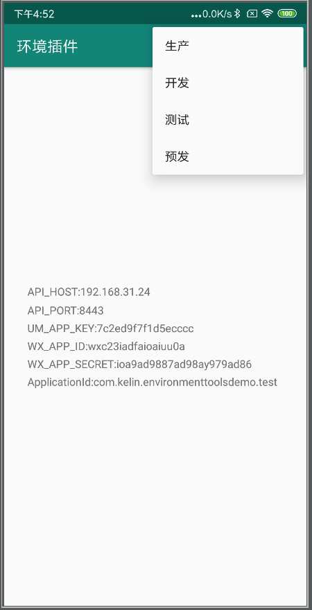
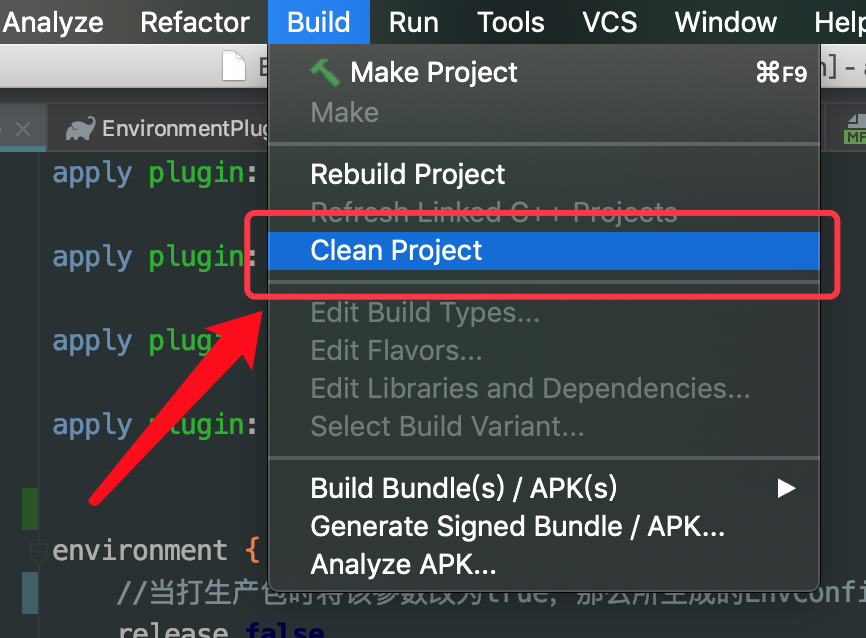
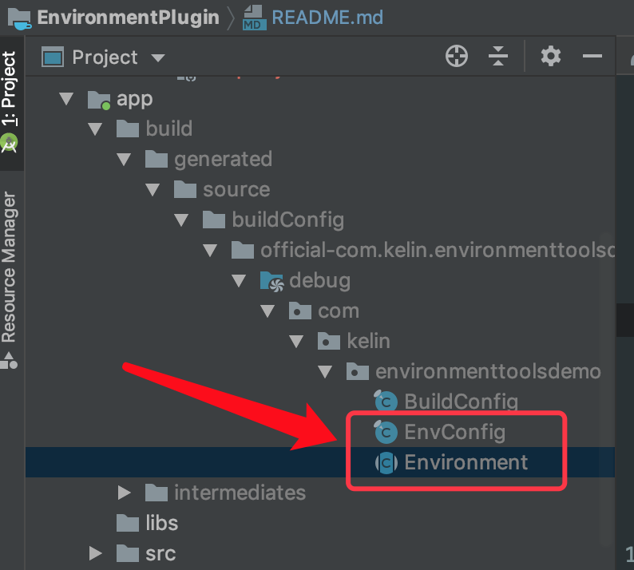

# EnvironmentPlugin
###### 一款用来配置环境的插件，可以在开发时可以切换不同环境的情况，而在打生产包后又不会导致非生产环境泄漏。
* * *

## 简介
在gradle中配置开发时的所有环境，你只需要很少的代码就能实现环境动态切换的功能。而在打生产包时你只需要在
gradle中做非常少的变动就能将非生产环境剔除，从而保证非生产环境不会泄漏。
在gradle中配置完成后只需要clean一下就会在buildConfig的目录中生成一个EnvConfig的类，你只需要通过
EnvConfig.getEnv()方法就能获取到所有你在gradlew中配置的值，而此时你不需要关心自己当前处于哪个环境。
切换环境时你只需要调用EnvConfig.setEnv(Type type)方法切换当前环境即可。


## 体验
[点击下载](https://fir.im/fwqn)或扫码下载DemoApk


## 下载
###### 第一步：添加 gradlew plugins 仓库到你项目根目录的 gradle 文件中。
```groovy
buildscript {
  repositories {
    maven { url "https://plugins.gradle.org/m2/" }
  }
  dependencies {
    classpath "gradle.plugin.com.kelin.environment:environment:1.1.2"
  }
}
```
###### 第二步：在module中引入插件。
```groovy
apply plugin: "com.kelin.environment"
```

## 效果图


## 使用
#### 在App gradle中添加如下配置。
```groovy
environment {
    //当打生产包时将该参数改为true，那么所生成的EnvConfig类中就不会包含releaseEnv以外的内容，避免开发、测试等环境泄漏。
    release false

    //配置初始化环境(应用首次安装到设备上的默认环境)，改参数也是用来配置manifestPlaceholders的环境的。
    initEnvironment "test"

    //当release的值为false时的包配置。
    devConfig {
        appIcon "@mipmap/ic_launcher"
        appName "环境插件"
//        versionCode 1
        versionName "1.0.0"
    }

    //当release的值为true时的包配置。
    releaseConfig {
        appIcon "@mipmap/ic_android"
        appName "@string/app_name"
//        versionCode 1
        versionName "2.0.0"
    }

    releaseEnv {
        alias "生产"

        variable "API_HOST", "192.168.31.24"
        variable "API_PORT", "8443"
        variable "UM_APP_KEY", '7c2ed9f7f1d5e10131d', true
        variable "WX_APP_ID", "wxc23iadfaioaiuu0a"
        variable "WX_APP_SECRET", "ioa9ad9887ad98ay979ad86"
    }

    testEnv {
        alias "测试"

        variable "API_HOST", "192.168.36.18"
        variable "UM_APP_KEY", '7c2ed9f7f1d5eewiai', true
    }

    demoEnv {
        alias "预发"

        variable "API_HOST", "192.168.36.18"
        variable "UM_APP_KEY", '7c2ed9f7f1d5eewiai', true
    }
}

android{
    //...省略N多行代码
}
```
#### 然后clean一下项目。


#### 然后你就能得到下面这两个类，EnvConfig 和 Environment。


###### EnvConfig
```java
public final class EnvConfig {
  public static final boolean IS_RELEASE = Boolean.parseBoolean("false");

  public static final Type INIT_ENV = Type.nameOf("test");

  private static final Environment RELEASE_ENV = new EnvironmentImpl("192.168.31.24", "8443", "wxc23iadfaioaiuu0a", "ioa9ad9887ad98ay979ad86", "7c2ed9f7f1d5e10131d");

  private static final Environment TEST_ENV = new EnvironmentImpl("192.168.36.18", "8443", "wxc23iadfaioaiuu0a", "ioa9ad9887ad98ay979ad86", "7c2ed9f7f1d5eewiai");

  private static final Environment DEMO_ENV = new EnvironmentImpl("192.168.36.18", "8443", "wxc23iadfaioaiuu0a", "ioa9ad9887ad98ay979ad86", "7c2ed9f7f1d5eewiai");

  private static Context context;

  private static Type curEnvType;

  EnvConfig() {
    throw new RuntimeException("EnvConfig can't be constructed");
  }

  public static void init(Application app) {
    context = app.getApplicationContext();
        curEnvType = Type.nameOf(PreferenceManager.getDefaultSharedPreferences(context).getString("current_environment_type_string_name", INIT_ENV.name()));
  }

  public static boolean setEnvType(Type type) {
    if (type != curEnvType) {
        curEnvType = type;
       if (context != null) {
           PreferenceManager.getDefaultSharedPreferences(context).edit().putString("current_environment_type_string_name", type.name()).apply();
       }
       return true;
    } else {
       return false;
    }
  }

  public static Type getEnvType() {
    return curEnvType;
  }

  public static Environment getEnv() {
    switch (curEnvType) {
        case RELEASE:
            return RELEASE_ENV;
        case TEST:
            return TEST_ENV;
        case DEMO:
            return DEMO_ENV;
        default:
            throw new RuntimeException("the type:" + curEnvType.toString() + " is unkonwn !");
    }}

  public enum Type {
    RELEASE("生产"),

    TEST("测试"),

    DEMO("预发");

    public final String alias;

    Type(String alias) {
      this.alias = alias;
    }

    private static Type nameOf(String typeName) {
      if (typeName != null) {
              for (Type value : values()) {
                  if (value.name().toLowerCase().equals(typeName.toLowerCase())) {
                      return value;
                  }
              }
          }
          return RELEASE;
    }
  }

  private static final class EnvironmentImpl extends Environment {
    EnvironmentImpl(String var0, String var1, String var2, String var3, String var4) {
      super(var0, var1, var2, var3, var4);
    }
  }
}

```
###### Environment
```java
public abstract class Environment {
  public final String API_HOST;

  public final String API_PORT;

  public final String WX_APP_ID;

  public final String WX_APP_SECRET;

  public final String UM_APP_KEY;

  protected Environment(String var0, String var1, String var2, String var3, String var4) {
    API_HOST = var0;
    API_PORT = var1;
    WX_APP_ID = var2;
    WX_APP_SECRET = var3;
    UM_APP_KEY = var4;
  }
}
```
#### 初始化。
在你的Application的onCreate方法中进行初始化。

```java
public class MyApp extends Application {
    @Override
    public void onCreate() {
        super.onCreate();
        EnvConfig.init(this);
    }
}
```
#### 获取当前环境。
```java
Environment env = EnvConfig.getEnv();
String apiHost = env.API_HOST;
String apiPort = env.API_PORT;
```
TODO("未完待续……")

* * *
### License
```
Copyright 2016 kelin410@163.com

Licensed under the Apache License, Version 2.0 (the "License");
you may not use this file except in compliance with the License.
You may obtain a copy of the License at

    http://www.apache.org/licenses/LICENSE-2.0

Unless required by applicable law or agreed to in writing, software
distributed under the License is distributed on an "AS IS" BASIS,
WITHOUT WARRANTIES OR CONDITIONS OF ANY KIND, either express or implied.
See the License for the specific language governing permissions and
limitations under the License.
```
